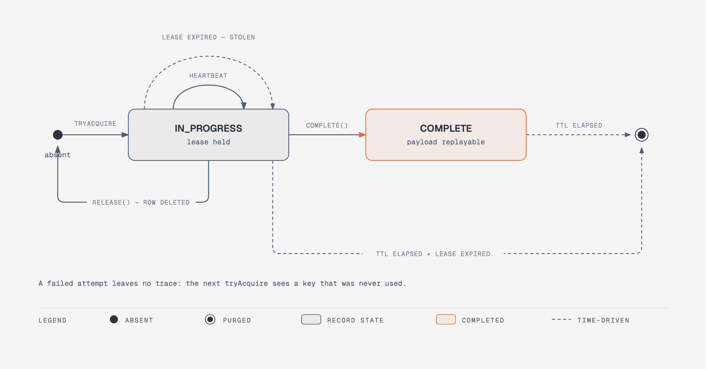
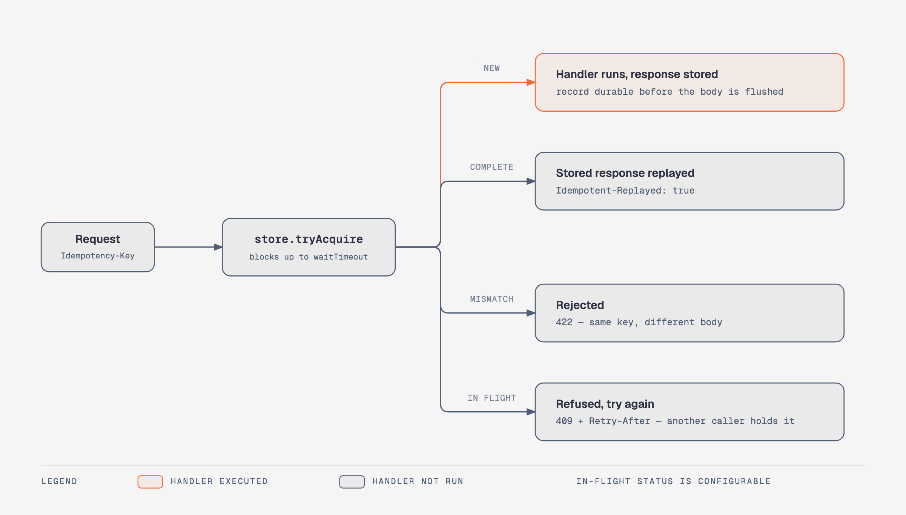

<p align="center">
  <picture>
    <source media="(prefers-color-scheme: dark)" srcset="docs/logo-dark.svg">
    
  </picture>
</p>

# idempotency4j

**An idempotency engine for Java. Give a unit of work a key: it runs once, and every duplicate gets
the stored result back.**

[](https://central.sonatype.com/artifact/io.github.josipmusa/idempotency-spring-boot-starter)
[](https://github.com/josipmusa/idempotency4j/actions/workflows/ci.yml)
[](https://javadoc.io/doc/io.github.josipmusa/idempotency-core)
[](https://adoptium.net/)
[](LICENSE)

`idempotency-core` is the whole library: an engine that acquires a lease on a key, runs your action
under a heartbeat, stores the result, and hands the stored result back to whoever shows up with
that key next. It has no framework or transport types in it, so you can drive it directly.

Everything else is an adapter over that engine, and you take only the ones you want:

| | |
|---|---|
| **Annotated methods** | `@Idempotent(key = "#event.id()")` on any Spring bean - a listener, a consumer, a service method |
| **HTTP** | A servlet filter reading the `Idempotency-Key` header and replaying stored responses |
| **Storage** | A three-method SPI, with JDBC, Redis, and in-memory implementations |

You need this if callers retry - payment processing, order creation, resource provisioning, an
at-least-once message broker - and a duplicate would cause a real problem: money charged twice, two
orders shipped, two VMs started.

## What this is not

**This is not an exactly-once guarantee for arbitrary downstream side effects.** Lease fencing
protects the idempotency record, not the third-party charge your action made just before the
process died. If you need that guarantee you still need a shared transaction, a transactional
outbox, or an idempotency key passed to the downstream service. This library makes *your* work safe
to retry; it cannot make *someone else's* endpoint safe to retry for you.

It is also not a distributed lock you can borrow for general use, and the HTTP adapter is
Servlet-only.

## Contents

- [Requirements](#requirements)
- [Quick start](#quick-start)
- [How it works](#how-it-works)
- [The engine](#the-engine)
- [Annotated methods](#annotated-methods)
- [HTTP endpoints](#http-endpoints)
- [Completing inside your transaction](#completing-inside-your-transaction)
- [Storage backends](#storage-backends)
- [Configuration](#configuration)
- [Lifecycle callbacks](#lifecycle-callbacks)
- [Limitations](#limitations)
- [Security](#security)
- [Contributing](#contributing)

## Requirements

| | Supported | Notes |
|---|---|---|
| Java | 21+ | Built and tested on 21 |
| `idempotency-core` | No framework | Plain Java, plus SLF4J |
| Spring Boot | 3.5.x | Built against 3.5.16, for the adapters and the starter |
| Annotated methods | Spring AOP | No web stack needed - works in a consumer or a batch job |
| Spring MVC (Servlet) | Yes | The HTTP filter activates only for Servlet web applications |
| Spring WebFlux | No | Nothing registers, and no error is raised |
| PostgreSQL | Tested on 16 | Via `idempotency-jdbc` |
| MySQL | Tested on 8.0 | Via `idempotency-jdbc` |
| Redis | 7+, tested on 7 | Standalone and Sentinel. Redis Cluster is not supported |

## Quick start

Add the Spring Boot starter and one storage backend:

```xml
<dependency>
    <groupId>io.github.josipmusa</groupId>
    <artifactId>idempotency-spring-boot-starter</artifactId>
    <version>0.3.0</version>
</dependency>

<!-- Pick one storage backend -->
<dependency>
    <groupId>io.github.josipmusa</groupId>
    <artifactId>idempotency-jdbc</artifactId>
    <version>0.3.0</version>
</dependency>
```

Or import the BOM and omit the versions:

```xml
<dependencyManagement>
    <dependencies>
        <dependency>
            <groupId>io.github.josipmusa</groupId>
            <artifactId>idempotency-bom</artifactId>
            <version>0.3.0</version>
            <type>pom</type>
            <scope>import</scope>
        </dependency>
    </dependencies>
</dependencyManagement>
```

With `idempotency-jdbc` on the classpath and a `DataSource` in the context, the store is wired for
you. On anything other than an embedded database, create the table first from the
`idempotency-schema-postgresql.sql` or `idempotency-schema-mysql.sql` file shipped in the provider
jar - see [Storage backends](#storage-backends).

**On a method**, name the key with a SpEL expression over the parameters:

```java
@Idempotent(key = "#event.id()", waitTimeout = "PT0S")
@KafkaListener(topics = "orders")
void on(OrderPlaced event) {
    // Runs once per event id, however many times the broker redelivers.
}
```

**On an HTTP endpoint**, the key is the client's header, so the annotation needs nothing:

```java
@PostMapping("/payments")
@Idempotent
public ResponseEntity<Payment> createPayment(@RequestBody PaymentRequest request) {
    // Duplicates get the stored response replayed.
    // The payment provider should also receive its own idempotency key.
    return ResponseEntity.ok(paymentService.charge(request));
}
```

**Without Spring**, build the engine yourself - see [The engine](#the-engine).

## How it works

A record is identified by a **scope** and a **key** together, never by the key alone. The key
identifies the attempt; the scope names the unit of work it belongs to. Both adapters default the
scope to `<simple class name>.<method name>`, so the same message id delivered to two consumers, or
the same `Idempotency-Key` sent to two endpoints, is two independent records rather than one
silently skipping the other's work.

Each record moves through a small state machine. There are two states, not three: a record is
absent, `IN_PROGRESS`, or `COMPLETE`. Releasing deletes the row, so a failed attempt leaves no trace
at all and the next caller sees a key that was never used. Every acquisition carries a lease, and
`complete`, `release`, and the heartbeat all have to present a matching lease, which is what fences
a stale owner out after its lease has been stolen:

<picture>
  <source media="(prefers-color-scheme: dark)" srcset="docs/diagrams/record-lifecycle-dark.png">
  
</picture>

Two durations govern this, and they are set independently. `lease` is how long an acquisition is
protected; `wait` is how long a second caller blocks for someone else's. The heartbeat fires at
`lease / 2`, so an action that legitimately runs longer than its lease keeps it rather than having
it stolen mid-flight. An action that dies without releasing leaves an expired lease, which the next
`tryAcquire` steals atomically.

The blocking happens inside the store, not in the engine. A concurrent duplicate waits inside
`tryAcquire` for the holder to finish, and only gives up once `wait` elapses - which is why a
duplicate arriving mid-flight usually gets the real result rather than an error. A caller that must
not block sets `wait` to zero and is told the record is in flight straight away.

Responsibilities are split across four layers, and the boundaries are enforced by design:

| Layer | Module | Owns |
|---|---|---|
| Engine | `idempotency-core` | The whole lifecycle: acquire, heartbeat, run, encode, complete, release on failure. No framework or transport types |
| Spring | `spring/idempotency-spring` | Everything Spring but not HTTP: `@Idempotent`, the AOP interceptor, transaction participation |
| HTTP | `spring/idempotency-spring-web` | Servlet capture and replay, error mapping, turning an `Outcome` into a response |
| Store | `providers/*` | The SPI. All blocking, waiting, and stale-lease stealing happens inside `tryAcquire` |

## The engine

`IdempotencyEngine.execute` is the entire API. It acquires the lease, runs the action with a
heartbeat, encodes and records the result, releases on any failure, and fires the
[lifecycle callbacks](#lifecycle-callbacks) around all of it. What comes back is a sealed `Outcome`
you switch on.

A caller with nothing for a duplicate to replay uses the runnable overload:

```java
IdempotencyEngine engine = new IdempotencyEngine(store, scheduler);

IdempotencyContext context = IdempotencyContext.builder("ShipmentListener.onOrderShipped", event.id())
        .ttl(Duration.ofHours(24))
        .leaseDuration(Duration.ofSeconds(30))
        .waitTimeout(Duration.ZERO)   // decline instead of parking the consumer thread
        .build();

switch (engine.execute(context, () -> handler.handle(event))) {
    case Outcome.Executed<Void> ignored -> { /* ran for the first time */ }
    case Outcome.Replayed<Void> ignored -> { /* already handled under this key */ }
    case Outcome.InFlight<Void> inFlight ->
            consumer.nack(inFlight.retryAfter());   // someone else has it; redeliver later
}
```

Add `.fingerprint(sha256Hex)` to the builder when the payload is worth guarding against key reuse:
two acquisitions clash only when both carry a fingerprint and the two differ.

When a duplicate should get a real result back, pass a `PayloadCodec<T>` for whatever the action
returns. A `Payload` is a `type` saying how to read the bytes, the bytes themselves, and flat string
`attributes` the store returns verbatim. Those attributes are where correlation data goes - the ids
of the messages the first execution published, say - so a duplicate can reference them instead of
publishing again.

```java
PayloadCodec<Handled> codec = new PayloadCodec<>() {
    @Override
    public Payload encode(Handled handled) {
        return new Payload(
                "shipment/handled",
                objectMapper.writeValueAsBytes(handled),
                Map.of("publicationId", handled.publicationId()));
    }

    @Override
    public Handled decode(Payload payload) {
        return objectMapper.readValue(payload.body(), Handled.class);
    }
};

Outcome<Handled> outcome = engine.execute(context, () -> handler.handle(event), codec);
```

`Outcome.Replayed` carries the decoded value from the original execution, so the same `switch`
handles a first run and a duplicate without the caller knowing which it got. The HTTP adapter's
`StoredResponseCodec` is exactly this for HTTP responses.

### When the store refuses the completion

The action ran and its side effects are durable, so `CompletionFailurePolicy` decides what happens
next. The default, `PROPAGATE`, rethrows the storage failure. `LOG_AND_RETURN` logs it and returns
`Executed` with the value anyway, which is what an HTTP adapter wants - the response the handler
produced should still reach the client. The lease is not released either way; the record stays in
progress until its lease expires, and a retry after that re-executes.

```java
IdempotencyEngine engine = new IdempotencyEngine(
        store,
        scheduler,
        List.of(),
        IdempotencyConfig.builder()
                .completionFailurePolicy(CompletionFailurePolicy.LOG_AND_RETURN)
                .build());
```

The starter wires its engine with `LOG_AND_RETURN`; set
`idempotency.completion-failure-policy=propagate` to change it.

## Annotated methods

`@Idempotent` works on any Spring bean method. A method has no transport to take a key from, so you
write a SpEL expression over its parameters:

```java
@Component
class OrderListener {

    @Idempotent(key = "#event.id()", waitTimeout = "PT0S")
    @KafkaListener(topics = "orders")
    void on(OrderPlaced event) {
        // Runs once per event id, however many times the broker redelivers.
    }
}
```

```java
@Idempotent(
    key = "#event.id()",        // SpEL over the method's parameters. Required here
    scope = "",                 // Empty: <simple class name>.<method name>
    ttl = "PT24H",              // How long the record stays replayable (ISO-8601)
    lease = "PT30S",            // How long this acquisition is protected
    waitTimeout = "PT10S",      // How long a concurrent caller blocks. "PT0S" to not block
    completion = "",            // autonomous | join-transaction
    codec = ""                  // PayloadCodec bean name, for a method that returns a value
)
```

Every attribute except `key` and `scope` takes the application default from
[Configuration](#configuration) when left empty. Anything malformed - an unparseable duration, an
unknown completion mode, an over-long scope - is rejected when the context starts, not on the first
message.

`waitTimeout = "PT0S"` is what you almost always want on a consumer thread: declining a redelivery
is cheap, parking a consumer thread is not. A call that finds the key in flight throws
`IdempotencyInFlightException`, which carries `retryAfter` so the broker can redeliver later.
Register an `OutcomeMapper` bean to answer differently.

A method that returns a value needs a `PayloadCodec` bean named in `codec`, so a duplicate call can
be given the original answer back. The module does not guess at a serialisation format, and a
value-returning method without a codec fails at startup:

```java
@Idempotent(key = "#command.id()", codec = "receiptCodec")
Receipt settle(SettleCommand command) { ... }
```

A `void` method needs none - there is nothing to replay - and must leave `codec` empty.

## HTTP endpoints

Clients send a key they generate themselves:

```http
POST /payments
Idempotency-Key: 550e8400-e29b-41d4-a716-446655440000
Content-Type: application/json

{ "amount": 100, "currency": "USD" }
```

Send it twice and the second response comes back from the store, carrying
`Idempotent-Replayed: true`. Send the same key with a different body and it is rejected with `422`.

Every request carrying a key resolves down one of four paths, decided entirely by the state the
record already holds in the store:

<picture>
  <source media="(prefers-color-scheme: dark)" srcset="docs/diagrams/request-outcomes-dark.png">
  
</picture>

An HTTP request brings its own key, so the filter reads only the durations and the scope from the
annotation:

```java
@Idempotent(ttl = "PT24H", lease = "PT30S", waitTimeout = "PT10S")
```

Whether a request without a key is rejected is `idempotency.web.required`, one answer for the whole
API rather than a per-endpoint one: an API that answers it differently per endpoint is one clients
cannot reason about. Set it to `false` where idempotency is offered rather than demanded - a request
with a key gets full enforcement, one without passes straight through.

### What gets stored

The filter stores whatever your handler returns, **including 4xx and 5xx responses**, as long as
the handler returns normally. A handler that returns `500` has that `500` replayed to every
duplicate for the full TTL.

A handler that *throws* is different: the engine releases the lease, which deletes the record, and
the next request with that key sees a key that was never used and runs the handler again.

If you want a failed request to be retriable, throw. If you return an error status, you are telling
the library that error is the final answer for that key.

The record is durable before the response body reaches the client, so a client that sees a response
can rely on a retry replaying it.

### Status codes the filter can return

These come from the filter itself, before or instead of your handler. Each carries a
`{"error": "..."}` JSON body.

| Status | When |
|---|---|
| `413 Payload Too Large` | Request body exceeds `idempotency.web.max-body-bytes` |
| `422 Unprocessable Entity` | Key header missing or blank while `idempotency.web.required` is true |
| `422 Unprocessable Entity` | Key longer than 255 characters |
| `422 Unprocessable Entity` | Key reused with a different request body |
| `409 Conflict` | Another request still holds the key after `waitTimeout`; carries `Retry-After`. Configurable through `idempotency.web.in-flight-status` |

### Response headers on a replay

| Header | Value |
|---|---|
| `Idempotent-Replayed` | `true` |
| `Cache-Control` | `no-store` |

The stored status code and headers are replayed as they were captured. A key completed through a
non-HTTP path has no response to replay, so an HTTP duplicate for that key gets `204 No Content`.

## Completing inside your transaction

By default the record is written on its own, the moment the action returns. That leaves a window: if
the process dies between your transaction committing and the record being written, the record stays
in progress and a redelivery runs the action again.

`completion = "join-transaction"` closes it. The engine writes the record inside the transaction the
method is already running in, so the record and your business writes commit together - a crash
before the commit leaves neither, a crash after it leaves both.

```java
@Transactional
@Idempotent(key = "#event.id()", completion = "join-transaction", waitTimeout = "PT0S")
void on(OrderPlaced event) {
    orders.save(new Order(event));
}
```

Three things have to be true for this to work, and the library tells you at startup or on entry if
they are not:

- **The store must support it.** JDBC does; the in-memory and Redis stores do not. Setting
  `idempotency.completion-mode=join-transaction` against a store that cannot support it fails the
  context at startup.
- **A transaction must already be active when the method is entered.** The transaction advisor has
  to run *outside* this one. Both default to `Ordered.LOWEST_PRECEDENCE`, which is a tie rather than
  an order, so break it with `@EnableTransactionManagement(order = Ordered.HIGHEST_PRECEDENCE)`. A
  joined context entered without an active transaction is an `IllegalStateException`, not a silent
  downgrade.
- **The store needs the caller's connection.** The starter wires a
  `TransactionAwareConnectionResolver` into the JDBC store for you, which runs `COMPLETE` on the
  transaction-bound connection and everything else on a connection of its own.

Under joined completion the terminal lifecycle callback moves with the record: `onCompleted` fires
after the commit, and a rollback releases the lease and fires `onFailed(..., ROLLBACK)`. Exactly one
terminal still fires per lease, just later.

Set `idempotency.completion-mode=join-transaction` to make it the application-wide default and leave
`completion` off the individual annotations.

## Storage backends

| Module | Use when | Autoconfigured |
|---|---|---|
| `idempotency-jdbc` | You have a relational database. PostgreSQL and MySQL | Yes, from a single `DataSource` bean |
| `idempotency-redis` | You have Redis. Standalone and Sentinel topologies | No - declare the connection and the store |
| `idempotency-inmemory` | Local development and tests. Not for more than one instance | Only on `store-type: in-memory` |

A store bean you declare yourself always wins; the starter never replaces one.
`idempotency.store-type` decides what happens when you do not:

| Value | Behaviour |
|---|---|
| `auto` (default) | Build a JDBC store when the provider and a single `DataSource` are both present. Nothing otherwise |
| `jdbc` | Demand a JDBC store; fail at startup if the provider or the `DataSource` is missing |
| `in-memory` | Demand an in-memory store |
| `none` | Build nothing |

`auto` does not fall back to the in-memory store. An in-memory record set deduplicates within one
JVM until it restarts, which is not a property anything should acquire by accident - ask for it by
name. Whichever store is selected is logged at startup.

<details>
<summary><b>JDBC configuration</b></summary>

Nothing to declare: with `idempotency-jdbc` on the classpath and a `DataSource` in the context, the
store is built for you, complete with the `TransactionAwareConnectionResolver` that
[joined completion](#completing-inside-your-transaction) needs.

The table is another matter. `idempotency.jdbc.initialize-schema` follows the convention Spring Boot
uses for Session and Quartz:

```yaml
idempotency:
  jdbc:
    initialize-schema: embedded   # embedded (default) | always | never
```

`embedded` creates the table only on an embedded database, so a development H2 works out of the box
while a real database never gets DDL from a library behind its owner's back. On PostgreSQL or MySQL,
point Flyway, Liquibase, or your own migration at the `idempotency-schema-postgresql.sql` or
`idempotency-schema-mysql.sql` file shipped in the provider jar, or set `always` if you would rather
the store created it.

Constructing the store by hand still works, and there the `initSchema` flag is yours:

```java
@Bean
public IdempotencyStore idempotencyStore(DataSource dataSource) {
    return new JdbcIdempotencyStore(dataSource, false, new TransactionAwareConnectionResolver(dataSource));
}
```

</details>

<details>
<summary><b>Redis configuration</b></summary>

The Redis store uses [Lettuce](https://lettuce.io/). Open the connection with
`RedisIdempotencyStore.CODEC` so stored bodies stay binary-safe. The application owns the client and
the connection, which is why the beans declare their shutdown methods:

```java
@Bean(destroyMethod = "shutdown")
public RedisClient redisClient() {
    return RedisClient.create("redis://localhost:6379");
}

@Bean(destroyMethod = "close")
public StatefulRedisConnection<String, byte[]> idempotencyRedisConnection(RedisClient client) {
    return client.connect(RedisIdempotencyStore.CODEC);
}

@Bean
public IdempotencyStore idempotencyStore(StatefulRedisConnection<String, byte[]> connection) {
    RedisIdempotencyStoreConfig config = RedisIdempotencyStoreConfig.builder()
            .keyPrefix("payments:idempotency:")
            .build();

    return new RedisIdempotencyStore(connection, config);
}
```

Use Redis 7 or newer. Choose an application-specific key prefix, and configure the server with
`maxmemory-policy noeviction` so records are not evicted out from under the store. One thread-safe
connection can serve the store.

The Redis store is not autoconfigured. It needs a `StatefulRedisConnection<String, byte[]>` - raw
Lettuce with a byte-array codec - rather than the `RedisConnectionFactory` Spring Boot produces.
Bridging the two would mean either reaching into Spring Data Redis internals or reimplementing
Boot's URL, Sentinel, SSL, and pooling handling and then running two clients with two lifecycles.
Both are worse than the three beans above.

A Redis store cannot enlist in a caller's transaction, so `completion = "join-transaction"` is not
available on top of it.

</details>

### Adding a backend

`IdempotencyStoreContract` in `idempotency-test` is the single source of truth for store behaviour.
Implement the SPI, extend the contract, implement `store()`, and pass all of it. A store that
supports transactional completion also extends `TransactionalStoreContract`. Behaviour changes
belong in the contract first, so every backend is held to them.

## Configuration

Everything is under the `idempotency` prefix. Transport-neutral settings sit at the top level; those
that only make sense over HTTP live under `web`, and those that only apply to a JDBC store under
`jdbc`, so an application that uses neither never has to read past the first group.

```yaml
idempotency:
  default-ttl: PT24H              # How long a completed record stays replayable. Default: 24h
  default-lease: PT30S            # How long an acquisition is protected. Default: 30s
  default-wait: PT10S             # How long a second caller blocks. PT0S to not block. Default: 10s
  completion-mode: autonomous     # autonomous | join-transaction. Default: autonomous
  completion-failure-policy: log-and-return   # log-and-return | propagate. Default: log-and-return
  store-type: auto                # auto | jdbc | in-memory | none. Default: auto

  jdbc:
    initialize-schema: embedded   # embedded | always | never. Default: embedded

  web:
    key-header: Idempotency-Key   # Header carrying the key. Default: Idempotency-Key
    required: true                # Reject a request that carries no key with 422. Default: true
    in-flight-status: 409         # Status when another caller holds the key. Default: 409
    max-body-bytes: 1048576       # Largest body the filter will fingerprint. Default: 1 MiB
    filter-order: 0               # Order of the filter in the chain. Default: 0

  purge:
    enabled: true                 # Register the purge scheduler. Default: true
    cron: "0 0 * * * *"           # Cron for purging expired records. Default: hourly
```

Two of these are worth a second look:

- **`completion-failure-policy`** defaults to `log-and-return` here, not to the engine's own
  `propagate`. When the action succeeded but the store refused to record it, the result the action
  already produced still reaches the caller; the idempotency guarantee is lost for that one key, and
  a later duplicate re-executes. Set `propagate` where losing the guarantee silently is worse than
  failing the call.
- **`purge.enabled`** needs `@EnableScheduling` on your application to do anything. The starter
  warns at startup if it is on without it, rather than quietly never purging.

## Lifecycle callbacks

Register an `IdempotencyLifecycleListener` bean to observe the idempotent boundary. The starter picks
up every listener bean and honours `@Order`; no other configuration is needed.

```java
@Bean
public IdempotencyLifecycleListener auditListener(AuditService audit) {
    return new IdempotencyLifecycleListener() {
        @Override
        public void onAcquired(IdempotencyContext ctx, String leaseId) {
            audit.begin(ctx.key());   // runs on the calling thread, before the action
        }

        @Override
        public void onCompleted(IdempotencyContext ctx, String leaseId, Payload payload) {
            audit.end(ctx.key());
        }

        @Override
        public void onFailed(IdempotencyContext ctx, String leaseId, Throwable cause, FailurePhase phase) {
            audit.abandon(ctx.key(), phase);
        }
    };
}
```

The contract, in short:

- Callbacks run **synchronously on the calling thread**, in registration order. That is deliberate:
  it lets a listener bind thread-local state that the guarded action then sees. A listener that
  blocks blocks the call.
- Exceptions thrown by a listener are logged at WARN and swallowed. They never change the stored
  payload, the return value, or the exception the engine is propagating.
- Every acquired lease gets **exactly one** terminal callback: `onCompleted` **or** `onFailed`,
  always preceded by `onAcquired` with the same lease. Use the pair to unbind whatever `onAcquired`
  bound.
- `onDuplicate` and `onInFlight` stand alone - neither acquires a lease, so no terminal callback
  follows.
- `onCompleted` fires only once the store has confirmed the completion. An unconfirmed durability
  guarantee counts as `onFailed` with `FailurePhase.COMPLETION`, which means the action's side
  effects happened but a retry will most likely run them again.
- A fingerprint mismatch acquires no lease and fires nothing. Heartbeat activity is not surfaced
  either.
- Under `join-transaction`, the terminal callback moves with the record: `onCompleted` fires after
  the commit, and a rollback fires `onFailed` with `FailurePhase.ROLLBACK`.

Outside Spring, pass the listeners to the engine directly:

```java
IdempotencyEngine engine = new IdempotencyEngine(store, scheduler, List.of(auditListener));
```

## Limitations

**No reactive support.** The HTTP adapter is built on `OncePerRequestFilter` (Servlet API), and the
engine's `execute` is blocking.

**No tenant isolation.** Records are scoped per method, but within a scope there is no built-in
per-tenant or per-user isolation: two callers using the same key in the same scope share idempotency
state. Prefix keys at the application level where that matters, for example `userId:clientKey`.

**Redis Cluster is not supported.** The provider takes Lettuce's non-cluster
`StatefulRedisConnection`, and its bounded SCAN purge is not node-aware. Standalone and Sentinel
master-replica connections work.

**Downstream side effects.** See [What this is not](#what-this-is-not).

## Security

The store persists whatever an adapter hands it. Over HTTP that means full response bodies, which
depending on your endpoints may include PII, tokens, or financial data.

- Enable encryption at rest on the backing database.
- Use TLS and ACLs for Redis, and restrict the ACL to the configured key prefix.
- Keep TTL values short to limit retention, and let `idempotency.purge.cron` remove expired records
  promptly. Purging needs `@EnableScheduling`.
- Audit what is annotated `@Idempotent`, what its results contain, and how large they can get.

To strip or redact sensitive fields before storage, register a `ResponseSanitizer` bean
(`io.github.josipmusa.idempotency.spring.web.ResponseSanitizer`). The default is a no-op
pass-through:

```java
@Bean
public ResponseSanitizer responseSanitizer() {
    return response -> {
        Map<String, List<String>> headers = new HashMap<>(response.headers());
        headers.remove("Set-Cookie");
        return new StoredResponse(response.statusCode(), headers, response.body());
    };
}
```

To report a vulnerability, see [SECURITY.md](SECURITY.md).

## Contributing

Issues and pull requests are welcome. [CONTRIBUTING.md](CONTRIBUTING.md) covers the build, the
conventions, and what a change to store behaviour needs.

Building requires Java 21 and Docker, since the JDBC and Redis provider tests run against real
databases through Testcontainers:

```bash
./mvnw spotless:apply   # formatting and license headers
./mvnw verify           # compile, all tests, format check
```

- [Changelog](CHANGELOG.md)
- [Code of conduct](CODE_OF_CONDUCT.md)
- [Security policy](SECURITY.md)
- [API documentation](https://javadoc.io/doc/io.github.josipmusa/idempotency-core)

## License

Apache 2.0. See [LICENSE](LICENSE).
